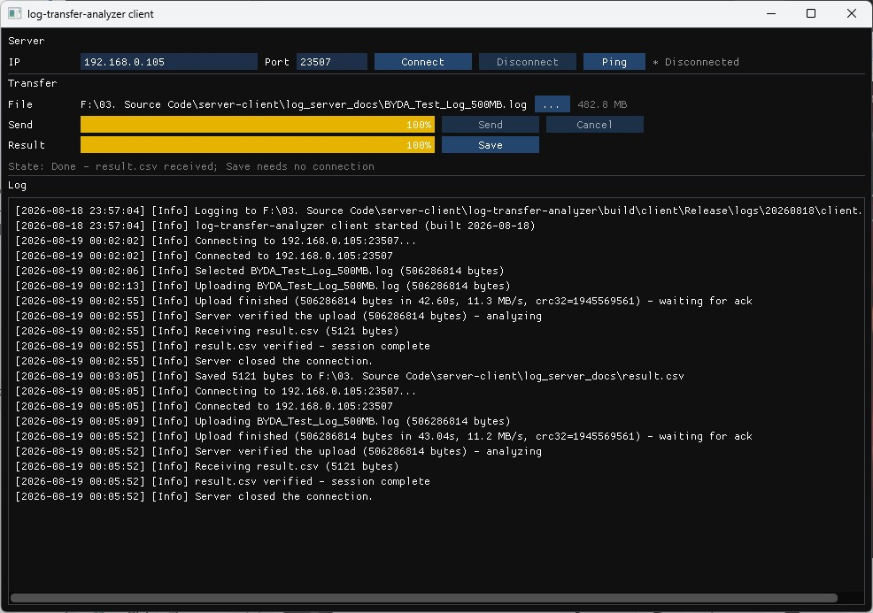

# log-transfer-analyzer

A client-server system for transferring and analyzing large log files. A Windows GUI client streams
a ~500 MB log file to a Linux C++17 server over TCP; the server parses the stream **while receiving
it**, keeps its whole process footprint far under 50 MB, skips corrupted lines without crashing, and
returns the statistics as `result.csv`.

Measured on the reference log (483 MB, 3,483,528 lines):

| | |
|---|---|
| Server peak RSS | **8.4 MB** — 17% of the 50 MB limit. Receiving 483 MB adds **176 KB** to it |
| Corrupted lines | 26, skipped and reported |
| Throughput | **87.1 MB/s** over a 1 Gb/s direct link; **11.3 MB/s** over 100 Mb/s (95% of line rate) |
| Client memory | 49.5 MB idle, 98.5 MB during a 483 MB transfer — also independent of file size |
| Deliverable | a single `client.exe`; no DLLs, no VC++ redistributable |

Neither program is the bottleneck at either link speed. The loopback E2E driver completes the same
round trip in 1.3 s.

---

## 1. Build

### Requirements

| | Linux (server) | Windows (client) |
|---|---|---|
| Compiler | GCC 9+ / Clang 10+ (C++17) | MSVC 2019 16.4+ (C++17) |
| Build system | CMake 3.16+ | CMake 3.16+ |
| Other | `tar`, POSIX | `tar` (Windows 10 1803+ has it) |

libuv, Catch2 and Dear ImGui ship as source tarballs under `3rdparty/` and are built by the scripts
below, so no third-party package needs installing. Only the toolchain itself may be missing on a
fresh machine, and the build scripts check for it before they compile anything.

### One command

```bash
./install_deps_linux.sh           # Linux, only if the toolchain is missing
./build_project_linux.sh          # Linux
build_project_window.bat          # Windows (from any prompt)
```

The script builds the third-party libraries from their tarballs if they are missing, configures
CMake in `build/`, compiles, and runs the unit tests. Outputs:

```
build/server/server                  # server binary (Linux)
build/client/Release/client.exe      # client (Windows)
build/tests/unit_tests               # unit test runner
```

`client.exe` is self-contained: libuv and the MSVC runtime are linked in, so it runs on a clean
Windows machine with nothing beside it, and `dumpbin /DEPENDENTS` lists only DLLs that ship with the
OS. The Linux `server` binary is not self-contained — see below.

### If the toolchain is missing

You do not have to remember to run `install_deps_linux.sh` first. `build_project_linux.sh` performs
the same check before it compiles anything, and stops with the list and the exact install command
rather than failing halfway through on `cmake: command not found`:

```
[INFO] Missing:
         - cmake >= 3.16 (found 3.9.6)

[INFO] Planned commands:
         sudo apt-get update
         sudo apt-get install -y cmake

[ERROR] Build prerequisites are missing (listed above).
        Install them:
          ./install_deps_linux.sh
        Or build and run without a toolchain at all:
          ./docker/build_images.sh && docker compose up
```

The check is silent when nothing is missing, so a normal build looks exactly as it always did.
`install_deps_linux.sh` knows apt, dnf/yum, pacman and zypper, matching on `ID` and then `ID_LIKE`
from `/etc/os-release` so derivatives such as Mint or Rocky resolve to their parent. `--check` only
reports and exits 1 if anything is missing; `--yes` installs without asking; an unrecognized
distribution gets the package list and a stop rather than a guess; and without root it prints the
commands to run as root instead of failing. Neither script ever installs anything on its own — a
build command that quietly changes system packages is not what anyone expects, so they report and
leave the decision to you.

On Windows the equivalent checks live in `build_project_window.bat`, because there is no package
manager to delegate to. It does more than report: if `cl.exe` is not on PATH it locates the Visual
Studio installation carrying the C++ toolset with `vswhere` and enters the x64 developer environment
itself, so the script runs from an ordinary prompt. Only when no such installation exists does it
stop, naming the workload to install and the minimum version — VS 2019 16.4, where `std::from_chars`
gained floating-point support. CMake is checked separately, because a developer prompt can have a
compiler and still no generator: `vcvars64.bat` does not put the bundled CMake on PATH unless the
"C++ CMake tools for Windows" component is installed. The 3rdparty scripts check `tar` and `cl`
before they extract anything.

You need none of this to *use* the client — `client.exe` ships prebuilt and self-contained. If you
do want to build it and have neither compiler nor CMake, the whole Windows toolchain is one command,
and the IDE-less Build Tools are enough because the script calls `vswhere` with `-products *`:

```powershell
winget install --id Microsoft.VisualStudio.2022.BuildTools --override ^
  "--quiet --wait --add Microsoft.VisualStudio.Workload.VCTools --add Microsoft.VisualStudio.Component.VC.CMake.Project"
winget install --id Kitware.CMake       # or rely on the VS component above
```

### The prebuilt Linux binary and its libuv

The `server` binary links libuv dynamically, so one shared library travels with it. Its `RUNPATH`
is resolved relative to the binary itself, not to the working directory:

```
$ readelf -d build/server/server | grep RUNPATH
 0x...(RUNPATH)  Library runpath: [$ORIGIN:$ORIGIN/../../3rdparty/libuv/lib/linux/async]
```

`$ORIGIN` is the directory the binary sits in, expanded by the loader at load time. The first entry
covers deployment — put `server` and `libuv.so.1` in the same directory and run it from anywhere:

```bash
$ cd / && /somewhere/else/server -h      # no LD_LIBRARY_PATH needed
```

The second entry covers the build tree, where `build/server/server` reaches back to the libuv that
`build_project_linux.sh` built under `3rdparty/`. A plain relative path such as `lib` would not
work for either: the loader resolves it against the *current working directory*, so it breaks as
soon as you `cd` elsewhere, and it lets any writable directory supply a library. `$ORIGIN` is the
only form that means "next to the executable".

Two things still travel with the binary. It was built on Ubuntu 24.04.4 LTS with GCC 13.3 for
x86-64 glibc, so a much older distribution may disagree about `libstdc++` symbol versions, and
`libuv.so.1` must stay beside it. `./build_project_linux.sh` rebuilds both from the bundled
tarballs on any supported machine, and the Docker image below removes the question entirely.

The Windows client is statically linked and the Linux server is not, which is deliberate rather
than an oversight — shipping `client.exe` meant shipping `uv.dll` beside it, and linking it in
removed a file the user could lose, whereas on Linux `$ORIGIN` keeps the pair together without
giving up the ability to swap libuv.

### If Windows refuses to run client.exe

On Windows 11 with Smart App Control enabled, launching the prebuilt `client.exe` may fail with
"blocked an app that might be unsafe". The reason is not a malware verdict: SAC requires either a
signature from a publisher it trusts or an established cloud reputation for that exact file, and a
freshly compiled unsigned binary has neither. Windows records the real reason under
**Event Viewer → Applications and Services Logs → Microsoft → Windows → CodeIntegrity →
Operational**, where the block appears as event 3077/3118 with the text "did not meet the Enterprise
signing level requirements".

The verdict is per-file and not stable over time: the same bytes were blocked and then allowed
minutes later during development, so retrying sometimes works. Rebuilding does not help — it
produces a new file with no reputation at all — and a self-signed certificate does not satisfy the
signing level SAC asks for.

**Building from source avoids the problem entirely**, because the binary is then produced on the
machine that runs it. That path is always available and is the recommended one if the prebuilt
executable is blocked.

### Manual build

```bash
(cd 3rdparty/libuv  && ./build_linux.sh)     # produces include/ and lib/
(cd 3rdparty/catch2 && ./build_linux.sh)
cmake -B build -DCMAKE_BUILD_TYPE=Release
cmake --build build -j
ctest --test-dir build --output-on-failure
```

`3rdparty/*/include/` and `lib/` are generated, not committed — the tarball plus the build script
is the source of truth.

### Sanitizer builds

Two configurations, deliberately exclusive — ASan and TSan intercept memory access in incompatible
ways, so enabling both is a hard CMake error rather than a silently dropped flag:

```bash
cmake -B build-asan -DENABLE_SANITIZERS=ON -DCMAKE_BUILD_TYPE=Debug   # ASan + UBSan
cmake -B build-tsan -DENABLE_TSAN=ON       -DCMAKE_BUILD_TYPE=Debug   # ThreadSanitizer
```

Each prints a `Sanitizers: ... ENABLED` line when it takes effect; the absence of that line is the
signal that the flag did not apply. Confirm the binary too — `ldd ./build-tsan/tests/unit_tests |
grep libtsan` — because the status line proves configure-time intent, not the artifact.

Both pass clean on the full suite: ASan reports no leaks, TSan reports no races over four runs with
randomized test order. ASan caught a dangling `string_view` during development that ordinary tests
did not.

On Ubuntu 24.04 TSan aborts at startup with `unexpected memory mapping`, because the distribution
raised ASLR entropy past what TSan's fixed shadow layout assumes. Run it under
`setarch $(uname -m) -R` to disable ASLR for that process; lowering `vm.mmap_rnd_bits` system-wide
would also work but weakens ASLR for the whole machine.

### Framework comparison: Catch2 vs GoogleTest (optional)

The suite is Catch2, and stays Catch2 — one framework, one set of fixtures. This optional target
exists to make that a measured choice rather than a default: the five crc32 test cases are
mirrored in GoogleTest (`tests/test_crc32_gtest.cpp`), built the same way as every other
third-party dependency (bundled tarball, Linux only):

```bash
(cd 3rdparty/gtest && ./build_linux.sh)
cmake -B build-gtestcmp -DCMAKE_BUILD_TYPE=Release -DENABLE_GTEST_COMPARISON=ON
cmake --build build-gtestcmp -j
./build-gtestcmp/tests/unit_tests "crc32*"     # Catch2:  5 cases, 17 assertions
./build-gtestcmp/tests/crc32_tests_gtest       # gtest:   5 tests
```

Measured on the build machine (GCC 13.3, `-O2`, medians of 3):

| | Catch2 3.15.3 | GoogleTest 1.15.2 |
|---|---|---|
| One-time framework build | 14.5 s (amalgamated TU) | 7.3 s (gtest-all + gtest_main) |
| Compiling the crc32 test TU | 0.71 s | 0.91 s |
| Running the five cases | instant | instant |

Both runs pass and assert the same values, as they must — the framework is the runner, not the
verification. The differences that actually matter in use: Catch2 decomposes `REQUIRE(a == b)`
and prints both sides on failure, runs cases in random order by default, and offers `SECTION`
for in-case branching; GoogleTest wants `EXPECT_EQ(expected, actual)` macros, fixed order unless
`--gtest_shuffle`, class fixtures (`TEST_F`) — and brings gmock and death tests, which Catch2
has no equivalent for. Nothing in this project needs mocks or death tests, which is why Catch2's
lighter ergonomics won. The comparison target is excluded from the default build and from
`build_project_linux.sh`; enabling it changes nothing about the 167-test suite.

### Running with Docker

`./build_project_linux.sh` on the host remains the supported path; the images exist so the server
can be built and run reproducibly on a machine whose distribution differs from the one documented
above. Two commands from the repository root:

```bash
./docker/build_images.sh          # base, then app
docker compose up                 # port 23507; artifacts land in ./out
```

Building is a script and running is compose, and the split is not arbitrary. The app image
references the base with `FROM log-server-base:latest`, so the two have to be built in that order —
starting with the app image fails with `log-server-base:latest not found`. Compose cannot enforce
that: `depends_on` orders service *startup*, not image builds. The script guarantees the order;
compose declares the run conditions. It also reuses an existing base image unless you pass
`--rebuild-base`, which is the point of the split: the base holds Ubuntu 24.04 — the same
distribution the prebuilt binary was built on — plus the toolchain and the third-party libraries
built from the bundled tarballs, none of which a server-code change affects.

The app image runs `build_project_linux.sh` itself, tests included, so an image cannot exist unless
the unit tests passed. It then runs `server -h` as a smoke test: if the loader cannot resolve libuv
or libstdc++, the build fails there rather than leaving the failure for `docker run` to discover.
The base image needs network access for `apt-get`; nothing else is fetched.

The `$ORIGIN` runpath described above works unchanged inside the image. Its second entry resolves
to `/app/3rdparty/libuv/lib/linux/async`, and the build path is fixed at `/app` in every container
started from the image.

Artifacts — `result.csv`, `skip_report.txt` and `logs/` — are written relative to the working
directory, which the image sets to `/app/out`. The bind mount in `compose.yaml` maps that to `./out`
on the host, so one line collects all three. Without it they would vanish with the container.

Two things worth knowing. The container runs the server in the foreground: its own `-d` flag would
end the container immediately, because the daemonizing double-fork exits the process Docker is
watching — let `docker compose up -d` do the backgrounding instead. And because file logging is
only enabled in daemon mode, a foreground container writes its log to stdout where `docker compose
logs` picks it up, so `./out/logs/` stays empty unless you pass `-d` to the server yourself.

Files in `./out` are owned by root, because the container runs as root. That is fine for reading
them; to own them yourself, run
`docker compose run --service-ports --user "$(id -u):$(id -g)" server`.

---

## 2. Running the server

```bash
./build/server/server                      # foreground, port 23507
./build/server/server -d -p 23507          # daemon
kill $(cat server.pid)                     # graceful shutdown
```

| Flag | Meaning |
|---|---|
| `-d` | Daemonize (double-fork, detach, log to file, write `server.pid`) |
| `-p PORT` | Listen port (default 23507) |
| `-c CONFIG` | Config file (default `./server.conf`; absent file is not an error) |

Artifacts are written relative to the working directory: `result.csv`, `skip_report.txt`,
`logs/<YYYYMMDD>/server.log` (daemon mode), `server.pid` (daemon mode). The log lives under a
dated directory because a daemon runs for days: the active file keeps a fixed name so `tail -f`
stays predictable, rotated files get a numeric suffix, and directories older than the retention
window are pruned.

The optional config file is plain `key=value` with `#` comments. It exists for benchmarking and
log placement only — protocol constants are never configurable, so a config file can never make
the client and server disagree:

```ini
chunk_size=65536        # receive/ring slot size (4 KB - 1 MB)
snd_buf_size=0          # SO_SNDBUF; 0 keeps kernel autotuning
log_path=./server.log   # base directory + file name; the file lands in <dir>/logs/<YYYYMMDD>/
```

Precedence is *built-in defaults < config file < command line*, so a benchmark sweep can change
one value per run from the command line. Unknown keys are rejected rather than ignored: a typo
like `chunck_size` would otherwise silently invalidate a measurement.

---

## 3. Network architecture

### 3.1 Wire protocol

Every message starts with a fixed 8-byte preamble, and all integers are big-endian. Structures are
never `memcpy`'d onto the wire — each field is serialized explicitly with shift operations, because
MSVC and GCC do not agree on padding and alignment.

```
offset 0  magic     4B  'B''Y''D''A'
offset 4  version   1B  = 1
offset 5  type      1B  1..5
offset 6  reserved  2B  = 0 (ignored by the receiver)
```

| Type | Direction | Body |
|---|---|---|
| 1 `UploadHeader` | client → server | `fileSize u64`, `filenameLen u16`, `filename` (≤255 B, UTF-8) |
| 2 `UploadTrailer` | client → server | `crc32 u32` of the payload |
| 3 `Ack` | server → client | `status u8`, `receivedBytes u64` |
| 4 `ResultHeader` | server → client | `csvSize u64`, `crc32 u32` |
| 5 `DownloadDone` | client → server | (no body) |

One session is one conversation:

```
client:  UploadHeader → payload (fileSize bytes) → UploadTrailer → (wait)
server:  (receive + parse concurrently) → Ack → ResultHeader → result.csv → (wait)
client:  (verify CRC) → DownloadDone → both sides clean up
```

**Why the checksum sits in different places per direction.** For the upload, computing a CRC up
front would mean reading 500 MB twice, so both sides compute it incrementally over the chunks they
are already handling and the client sends it in a trailer. The result CSV is only a few kilobytes
and already complete in memory, so its CRC travels in the header.

Chunk-level acknowledgements were deliberately left out: TCP already guarantees delivery, so they
would only add round trips. A single final acknowledgement carries the received byte count and the
checksum verdict.

### 3.2 Session state machine

```
LISTENING → WAIT_HEADER → RECEIVING → VERIFYING → ANALYZING → SENDING_RESULT → WAIT_DONE
     ▲                                                                             │
     └────────────────────────────── CLEANUP ◀─────────────────────────────────────┘
```

Any error, timeout, or abrupt disconnect in any state converges on the same `CLEANUP` path. That
is deliberate: if each failure kind had its own teardown, the number of code paths to test would
be the number of failure kinds multiplied by the number of states.

**Timeouts are attached to states, not to the connection.** A timer only runs while the server is
waiting on the *peer*:

| State | Waiting on | Timer |
|---|---|---|
| `WAIT_HEADER` | peer (`UploadHeader`) | 120 s |
| `RECEIVING` | peer (payload + trailer) | 30 s idle, reset on activity |
| `VERIFYING` | itself (CRC compare) | none |
| `ANALYZING` | itself (statistics + CSV) | none |
| `SENDING_RESULT` | peer (consuming the stream) | 30 s idle |
| `WAIT_DONE` | peer (`DownloadDone`) | 120 s |

Putting a timer on the server's own CPU work would produce a server that kills itself on a slow
machine. The state→timeout mapping lives in exactly one function so that adding a state cannot
silently forget its timer. Total transfer time is intentionally unbounded — a slow link is not a
failure; a *stalled* one is.

A silent failure (a pulled cable, a frozen peer, a dropped NAT entry) produces no socket error at
all, which is precisely why application-level timers are required rather than relying on TCP
keepalive, whose kernel defaults are measured in hours.

### 3.3 Concurrency model

The **server** runs two threads, fixed at startup:

| Thread | Owns | Sleeps on | Woken by |
|---|---|---|---|
| libuv loop | sockets, timers, state machine, receive CRC | epoll | kernel events, `uv_async_send` |
| parser (resident, 1) | reassembly buffer, statistics map, skip counters | `cv.wait` | condition variable |

Data moves one way through a bounded lock-free SPSC ring buffer. Ownership of a slot transfers
from producer to consumer on commit, so **no mutex protects the data itself** — the only
cross-thread signals are wake-ups:

```
loop → parser :  condition variable  (slot committed, upload complete, abort, shutdown)
parser → loop :  uv_async_send       (resume reading, analysis complete)
```

`uv_async_send` is the only libuv call that is safe from another thread, so it is the only one the
parser thread uses. Coalescing is assumed: several sends may collapse into one callback, so both
handlers are idempotent.

Because the statistics belong to the parser thread, the CSV is also built there and only the
finished buffer is handed to the loop. Keeping that boundary intact is what removes the need for
shared ownership at the end of a session.

The **client** runs three, for the same reason the server runs two — the thread that must never
block is kept clear of everything that can:

| Thread | Owns | Blocks on |
|---|---|---|
| UI (main) | ImGui/DX11 frame loop, `UiState` | nothing — it polls a queue and returns |
| libuv loop | socket, timers, upload pacing, CRC | epoll/IOCP |
| file reader | the 64 KB read into ring slots | disk I/O |

The reader exists because reading 500 MB from disk is the one operation that can stall for tens of
milliseconds at a time. Doing it on the loop thread would delay socket callbacks; doing it on the
UI thread would freeze the window, which the assignment explicitly forbids. Commands travel
UI → loop through a mutex-guarded queue plus `uv_async_send`, and events travel back through a
second queue that the UI drains once per frame. No UI code ever waits on a worker.

Verified rather than argued: sampling `IsHungAppWindow` — the same check Windows uses to decide
whether to paint "Not Responding" — every 500 ms across a 483 MB transfer produced zero hits.

### 3.4 One session at a time

The server serves a single session at a time. A connection that arrives mid-session is **not**
rejected — it simply is not accepted yet, so it waits in the kernel backlog and is served after
cleanup, with any bytes it sent in the meantime preserved. This removes the need for retry logic
in the client. The behaviour was verified experimentally before the design depended on it, and is
locked in by a regression test.

Single active session is by design and matches the assignment scenario; the session-encapsulated
architecture makes concurrent-session extension straightforward.

### 3.5 Daemon and signals

Initialization order is fixed — `signal defaults → argument parsing → daemonize → logger →
event loop → threads` — because `fork` clones only the calling thread: daemonizing after creating
threads would leave the child with locked mutexes and nobody to unlock them.

* `SIGPIPE` is ignored explicitly, so writing to a closed socket returns `EPIPE` through the normal
  error path instead of killing the process. This is exactly the path an abrupt disconnect takes.
* `SIGTERM`/`SIGINT` are received through `uv_signal` rather than a raw handler, which moves them
  onto the loop thread and out of async-signal-safe restrictions.
* During shutdown the termination signals are *blocked*, not merely ignored — `uv_signal_stop`
  restores the default disposition, and a second `SIGTERM` arriving in that window would kill the
  process mid-cleanup and leave a stale PID file.
* `SIGHUP` is ignored; there is no configuration reload.
* The conventional `chdir("/")` is deliberately skipped so that `result.csv` and the logs stay at
  predictable relative paths.

---

## 4. The client



The four controls the assignment asks for map onto the window like this:

| Required control | In the client |
|---|---|
| File selector | `...` next to the **File** row, opening the Win32 open dialog |
| Upload button | **Send** (a confirmation dialog names the file, its size and the destination) |
| Progress bar with live % | **Send** and **Result** bars, each showing its own percentage |
| Result download button | **Save**, which writes the received `result.csv` where you choose |

`Save` rather than `Download` because the download already happened: the CSV is a few kilobytes, so
the client receives and CRC-checks it automatically the moment the server sends it, and this button
is the step that puts it on disk. Naming it after what it does keeps the label honest.

Right after the CRC check the client also reads the CSV's metric block and, when the server
reports skipped lines, logs one warning:

```
[Warn] 26 of 3483528 lines were skipped - BAD_FRAME 13, UNKNOWN_MODULE 13
```

The parser behind it is deliberately lenient, because a strict one would recreate the very defect
this warning exists to catch ("a small format change and data disappears without a word" — this
time in the client). It splits blocks on the blank line and looks rows up by name, never by
position; it collects reason rows by the `skip_reason_` prefix without hardcoding the code list,
showing the top three by count; if `total_lines` is missing it drops the `of M` denominator and
reports the count alone — a percentage is never shown, because 26 of 3.4M rounds to 0.00% and
says less than the pair does; and no parsing failure of any kind blocks **Save** — a malformed summary costs
the warning, never the result file.

The screenshot is the finished state of a 483 MB transfer, and it shows the one combination that
needs explaining: the indicator reads **Disconnected** while **Save** is enabled.

That is not a bug, it is the protocol. The server serves one session at a time, so the moment it
sends the last CSV byte and receives the acknowledgement it closes the connection to free itself
for the next client. The result already lives in the client's memory, verified by CRC. Gating Save
on an open connection would therefore make it a button nobody could ever press — the server closes
faster than a human reacts. The `State:` line says so in words rather than leaving the user to
infer it.

**One axis, not two.** Every control is gated on the *actual* link state plus the session state.
An earlier design added a separate "intent" axis, which produced cells like "shows Disconnected but
Connect is greyed out" — the user then has to work out which button applies. Treating a dropped
link as a disconnection means the window only ever tells one story: grey, and only Connect is
available; green, and Send and Disconnect are.

**Browse is always enabled** because picking a file is a local operation. It also makes the natural
order "choose file, connect, send immediately", which keeps the server's 120-second header timeout
from ever being relevant.

**Send asks first.** A 483 MB upload is effectively irreversible: cancelling still consumes a server
session and discards the transferred bytes. The dialog names the file, its size and the
destination, so the confirmation is about *this* transfer rather than a generic "are you sure".

**Ping is delegated to the OS.** The button launches `ping -t` in its own console window rather
than implementing ICMP in-process. The first version did implement it, drawing replies into a panel
inside the client window, and two problems showed up immediately: the panel could not be moved out
of the way because it was confined to the client's own window, and the replies scrolled past faster
than they could be read. A console window is resizable, scrollable, movable to a second monitor,
and keeps running while the user goes back to transferring. The IP is validated as four numeric
octets before it reaches the shell, since the address ends up on a command line.

Measuring confirmed the delegation has a second benefit: pinging an unreachable address produced
no UI stall at all, because the waiting happens in a different process entirely.

---

## 5. Memory optimization strategy

The requirement is a process-wide ceiling, so every buffer in the process is bounded — a bound on
the queue alone would be defeated by any unbounded buffer downstream.

| Buffer | Bound | Enforced by |
|---|---|---|
| Ring buffer | **4 MB budget** | slot count derived from the budget |
| Line reassembly | 64 KB | maximum line length |
| Header framing | 273 B | largest possible message |
| Skip report samples | 100 lines × 200 B | explicit caps |
| Statistics map | 10,000 entries | entry limit |
| Result CSV (build side) | ~5 KB in practice | 10,000 entries x 57 B row = 557 KB absolute ceiling |
| Result CSV (receive side) | **4 MiB** | `kMaxCsvSize`, checked before the buffer is reserved |

**Zero-copy receive.** libuv asks the application for a buffer before every read. Instead of
allocating one, the session hands back an empty ring slot, so bytes land directly in the queue the
parser will read — there is no copy between the socket and the parser, and no allocation on the
data path at all. Two small exceptions exist, both bounded: the chunk that carries the upload
header may also carry the first payload bytes, which are copied into a ring slot once per session,
and the ≤12-byte trailer tail is copied out before the slot ownership transfers.

**Backpressure is the ceiling mechanism.** When the ring fills, the server stops reading; the
kernel receive buffer fills, the TCP window closes, and the sender throttles itself. When the
parser frees a slot it wakes the loop to resume. No unbounded queue can form, so memory does not
track the file size.

**The budget is in bytes, not slots.** An earlier version fixed the ring at 64 slots; a benchmark
sweep then showed that a 1 MB chunk setting produced a 64 MB ring and a 69 MB peak — a
configuration value could breach the process limit. Slot count is now computed from a fixed 4 MB
budget, and the same sweep now peaks at 9.4 MB with 1 MB chunks.

**No manual memory management.** `new`, `delete`, `malloc`, `free`, `calloc`, and `realloc` are not
used to allocate or release anything, anywhere in the sources. Ownership is expressed with
`std::unique_ptr`, STL containers, and move semantics. Because `uv_close` is asynchronous, handle
memory is owned by a `unique_ptr` whose ownership transfers to the close callback if the wrapper
dies first, which keeps teardown safe even when a peer disappears mid-callback.

A plain `grep delete` does return many hits. Every one is `= delete` on a copy or move constructor —
the deleted-function syntax that suppresses copying, which is part of the RAII discipline rather than
a violation of it. To check the rule directly rather than take this paragraph's word for it:

```bash
grep -rnwE 'new|malloc|calloc|realloc' --include=*.cpp --include=*.h common server client tests
grep -rnwE 'delete|free' --include=*.cpp --include=*.h common server client tests | grep -v '= delete'
```

Together they print six lines: four comments that name the forbidden keywords while explaining why
they are avoided, and two test-case titles containing the English words "new" and "use-after-free".
No line allocates or releases anything.

Third-party code under `3rdparty/` is out of scope and untouched by us: libuv is C, and Dear ImGui —
which the assignment names as an acceptable client framework — brings its own allocator.

### Measured

Reference log (483 MB), loopback, median of 3 runs per setting:

| Chunk size | Throughput | Server CPU | Peak RSS |
|---|---|---|---|
| 32 KB | 375 MB/s | 2.31 s | 6.4 MB |
| **64 KB** (default) | 379 MB/s | 2.26 s | **8.4 MB** |
| 128 KB | 379 MB/s | 2.21 s | 8.6 MB |
| 1 MB | 378 MB/s | 2.19 s | 9.4 MB |

Throughput and CPU are flat across the range: system-call overhead has already converged below
32 KB, so a larger chunk buys nothing and only costs memory. Sweeping `SO_SNDBUF` from 64 KB to
4 MB was equally flat, which is the expected result on loopback where the bandwidth-delay product
is effectively zero — the socket buffer is not the bottleneck in this environment, so the final
configuration leaves it to kernel autotuning.

Those absolute throughputs reflect the harness as much as the server: the driver is Python and runs
over loopback. What the sweep is for is the chunk decision, and loopback is the right place to make
it — at 375 MB/s the syscall rate is higher than any real link produces, so a chunk size that buys
nothing there buys nothing anywhere slower.

**Server memory over a real link**, sampled from `/proc/<pid>/status` on the same process before and
after a transfer, so the delta is attributable:

| | VmHWM |
|---|---|
| Idle, before any session | 8,380 KB |
| After receiving and analyzing 483 MB | 8,556 KB |
| **Attributable to the transfer** | **176 KB** |

Peak memory is essentially the startup footprint. Across arrival rates spanning 33x — 11.3 MB/s on
100 Mb/s, 87.1 MB/s on 1 Gb/s, 375 MB/s on loopback — peak RSS stayed near 8.4 MB every time. The
bound is not a claim about one measurement; it holds where the ring actually fills and where it
never does.

**Client, measured with the real GUI over a real link:**

| | Idle | During a 483 MB transfer |
|---|---|---|
| Working set | 49.5 MB | 98.5 MB |

The ~49 MB baseline is ImGui + DX11 + Win32, not the transfer path. The delta is bounded by the
same mechanism as the server: a 4 MB ring budget plus at most 8 in-flight 64 KB writes (0.5 MB),
so peak memory does not track file size — a 5 GB file would show the same figures.

**End-to-end over a real network**, client and server on separate machines:

| Link | Time for 483 MB | Throughput | Share of line rate |
|---|---|---|---|
| 100 Mb/s switched | 42.6 s / 43.0 s (two runs) | 11.3 / 11.2 MB/s | 95% |
| 1 Gb/s direct | 5.54 s | 87.1 MB/s | 73% |

The 1 Gb/s run does not saturate the link, and the missing share is on the client's disk rather than
in either program: the log lives on a hard drive that reads at 82 MB/s cold, which is below the link
rate. An earlier run of the same build reached 97 MB/s with the file already in the page cache.

Raising the in-flight write cap was considered and rejected. Changing nothing but the network took
the same build from 11.3 to 87.1 MB/s — an eightfold change that a cap of 8 x 64 KB could not have
allowed if it were the limit. At 100 Mb/s the link is the bound and at 1 Gb/s the client's disk is;
in neither case is it the cap. `uv_write` completes when bytes reach the kernel send buffer rather
than when the peer acknowledges them, so 0.5 MB in flight is ample at sub-millisecond LAN latency.

---

## 6. Corrupted data handling

The reference log contains deliberately damaged lines. The parser must skip them, log them, and
finish parsing every remaining line.

**The filter is a whitelist, not a blacklist.** Filtering out the specific damage patterns that
happen to be present would leave the parser open to the first unfamiliar one. Instead a line is
accepted only if it matches the known-good structure exactly; everything else is skipped with a
reason code. This was not a theoretical concern: the log turned out to contain a fifth damage type
that the initial analysis had missed, and the whitelist rejected it correctly with no code change.

### Validation pipeline

A line passes through five stages in order and stops at the first failure:

| Stage | Checks | Reason codes |
|---|---|---|
| 0 · bytes | length cap, empty/blank, control characters, `\r` handling | `LINE_TOO_LONG`, `EMPTY`, `CTRL_CHAR` |
| 1 · frame | `[ts][pid][tid][sess] BYDA::Module: message` by position | `BAD_FRAME` |
| 2 · timestamp | format, calendar validity, ±48 h from the first good line | `BAD_TIMESTAMP`, `TS_OUT_OF_RANGE` |
| 3 · numbers | `from_chars`, full-token consumption, `int64` range, `isfinite` | `BAD_NUMBER`, `NUM_OUT_OF_RANGE` |
| 4 · domain | bracket pairing, module whitelist, speed range | `BAD_BRACKET`, `UNKNOWN_MODULE` |
| 5 · resources | statistics map entry cap | `MAP_LIMIT` |

Details that matter in practice:

* **Position-based parsing, no regular expressions** on the hot path — a regex on adversarial input
  invites catastrophic backtracking.
* **`std::from_chars` only.** `stod`/`atoi`/`sscanf` are absent. Parsing success is not validity:
  one damaged line carries `spd[888888888888888888888.88]`, which `stod` accepts happily as
  8.9e20 and which would destroy the average. Every number is range-checked after parsing, and
  every double is checked with `isfinite` because `from_chars` accepts `inf` and `nan` as text.
* **Length-based string handling** (`string_view`) throughout, so an embedded null byte truncates
  nothing.
* **Timestamps are range-checked against the session.** A random far-future timestamp would parse
  successfully and create a new statistics bucket; without the range check that is an unbounded
  memory growth path, not merely a wrong number.
* **A damaged line never stops the run.** Line reassembly reports an over-long line once, discards
  to the next newline, and resumes.

### Skip reporting

Counters are `uint64` and unbounded in value; the raw text is not. The first 100 skipped lines are
recorded with their reason code and byte offset, capped at 200 bytes each and with control
characters escaped, and the report states how many further lines were omitted. A few million
damaged lines therefore cannot fill the disk — the log about bounded buffers is itself bounded.

`result.csv` also carries the evidence in the deliverable itself: `skipped_lines` with the total,
and one `skip_reason_<CODE>` row per non-zero reason (see the output format section). The reason
codes in the CSV are exactly the codes of the table above — the same `skipReasonCode()` strings —
so the report and the CSV cannot drift apart. The client reads these rows to warn the user; a
format change that silently discards lines is therefore no longer silent anywhere in the chain.

---

## 7. Output format

`result.csv` has two blocks separated by a blank line, each with its own header row, so ordinary
CSV readers can parse both:

```csv
module,hour,count
AntennaProfileSpec,2026-06-19 22,23502
...

metric,value
total_lines,3483528
avg_speed,137500.000000
valid_spd_samples,580661
excluded_spd_samples,0
missing_spd_samples,0
skipped_lines,26
skip_reason_BAD_FRAME,13
skip_reason_UNKNOWN_MODULE,13
```

The hour key includes the date because the reference log spans 24.7 hours, so hour 22 occurs on two
different days and would otherwise collide. Rows are sorted by module name, then chronologically.
A label line such as `[Task 1]` was rejected precisely because it breaks CSV parsers.

The metric block is a name contract, not a layout: row names are stable, consumers look rows up by
name rather than by position, and unknown rows must be ignored — that is what lets the server add
rows without breaking existing readers. Three rows need their semantics stated. `total_lines` is
the denominator the client uses for its skip warning, published explicitly because deriving it by
summing buckets goes wrong exactly when it matters most — when `MAP_LIMIT` has truncated the
buckets. `skip_reason_<CODE>` rows carry the per-reason skip counts, emitted only for non-zero
reasons in code-alphabetical order; an absent row means zero, and the full table including zeros
lives in `skip_report.txt`. `missing_spd_samples` counts lines that were **counted, not skipped** —
a known-module line whose `spd` field is absent contributes to Task 1 but not to the average — and
completes the identity `BeamSteerCtrlUnitImpl bucket total = valid + excluded + missing`, which a
unit test pins.

---

## 8. Tests

```bash
ctest --test-dir build --output-on-failure          # 168 unit tests
python3 tests/e2e/run_e2e.py --server build/server/server
python3 tests/perf/sweep.py  --server build/server/server
```

The end-to-end driver and the benchmark sweep use the Python standard library only — no
installation step.

**Unit tests (Catch2, 168 cases)** cover the CRC vector
(`"123456789"` → `0xCBF43926`), codec round trips including every truncation point, framer
accumulation, SPSC ring behaviour under two-thread contention, each validation stage with its own
damaged-line fixture, and the session state machine driven over real loopback sockets. Three of the
four state timers are covered directly — a stalled upload in `RECEIVING`, a ghost connection in
`WAIT_HEADER`, and a client that never acknowledges in `WAIT_DONE` — and each asserts that the next
connection is served afterwards, because on a 1:1 server a timer that fails to reap does not leak a
session, it stops the server. On the client side, a server that rejects an upload is covered for all
four Ack statuses, asserting the reason reaches the log rather than the session failing silently.

**End-to-end scenarios (15)** run against the real server binary and speak the protocol from an
independent Python implementation — deliberately not reusing the server's own codec, and using
`zlib.crc32` so the CRC implementation is cross-checked rather than compared with itself. They
cover the happy path, an empty file, eleven kinds of damaged data (five observed in the reference
log plus six the design had never seen), CRC mismatch, protocol violations of both classes, a
header split byte by byte, abrupt disconnection during upload and during result delivery, backlog
behaviour with two clients, peak RSS under the limit, and daemon mode. Two further scenarios are
opt-in because they are slow: the full 483 MB log (`--log <path>`) and the 120-second header timeout
(`--slow`).

Every scenario also asserts that the server exits cleanly afterwards. That check found a real
regression: a shutdown deadlock in which the process never left its event loop.

---

## 9. Repository layout

```
common/              shared by client and server (libuv + standard library only)
  protocol/          protocol constants, codec, message framer
  net/               socket interface, TCP socket, listener, timer
  util/              CRC32, SPSC ring buffer, logger
server/src/
  app/               entry point, CLI/config, daemonization, signals
  session/           session state machine, 1:1 session manager
  parser/            line reassembly, validation pipeline, parser thread, skip report
  stats/             per-module hourly counts, speed statistics
  csv/               result.csv builder
client/src/          Windows GUI client (Dear ImGui + Win32/DX11)
  app/               entry point, window, frame loop, wiring
  service/           libuv worker thread, file reader thread, session state machine
  ui/                UiState (gating), UiRenderer (drawing), file dialogs, ping console
tests/               Catch2 unit tests, Python E2E driver, benchmark sweep
3rdparty/            libuv, Catch2 and Dear ImGui source tarballs + build scripts
install_deps_linux.sh  toolchain check/installer (apt, dnf/yum, pacman, zypper)
```

`common/` depends on libuv and the standard library only — no OS headers and no `long`, so the same
sources compile under both MSVC and GCC.

---

## 10. License

Copyright (c) 2026 Beomsik Kim. All rights reserved.

This repository is published for review. It is not open source: copying, modifying,
redistributing, or reusing this code in another project requires the author's permission.

The `BYDA::` log format this parser handles was specified by the assignment and is not
the author's work.
